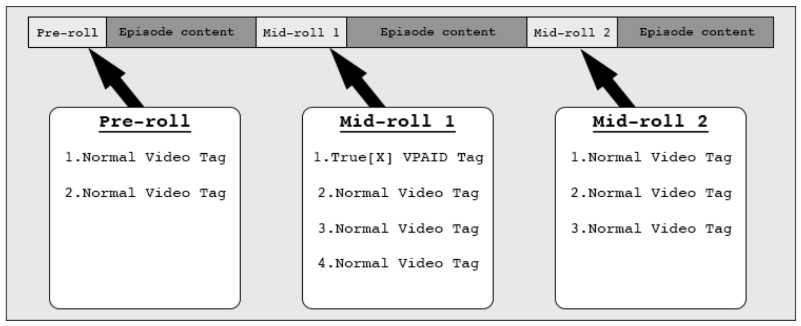

# true[X] VPAID Integration Guide - Desktop and Mobile

### Requirements
1. VAST and VPAID Support
2. true[X] Tag Flighting
3. Custom Event Handlers

### 1. VAST and VPAID Support
Your native player must support VAST and VPAID. The IAB specs are available here:

VAST: http://www.iab.net/guidelines/508676/digitalvideo/vsuite/vast

VPAID: http://www.iab.net/guidelines/508676/digitalvideo/vsuite/vpaid

true[X] ads will work with VAST 1.0+ and VPAID 2.0+. They are javascript based and follow the specifications outlined in Section 8 of the VPAID 2.0 spec.

If your video player has a countdown timer (e.g. “30 seconds until content resumes”) or an ad countdown (e.g. “Ad 1 of 4”), we suggest disabling it or reverting to more generic text (e.g. “Your video will resume shortly”) when our unit is loaded. Our ad unit will identify itself as “trueX” in the VAST AdSystem element, as outlined in Section 2.2.4.1 in the VAST 3.0 spec.

#### Mobile-specific Requirements
For mobile implementations, we suggest loading a WebView and locking the orientation to landscape. This webview should also allow inline media playback, as well as media playback without user interaction to fully support our mobile ad experiences.

On Android, we will also require DOM storage to be enabled.

### 2. Custom Flighting
For the Sponsored Ad Break product (mid-roll ad elimination), you will need to flight the true[X] tag to the first slot of **each desired mid-roll pod**:

In this scenario, the true[X] unit is only available in the first mid-roll. If an ad is available, the user will be
offered the opportunity to skip 3 video ads in Mid-roll 1 if they interact with true[X]. Pre-roll and Mid-roll 2 are unaffected.

### 3. Custom Event Handlers
The true[X] unit will dispatch a custom `VPAIDEvent` -- this event will signal that the user has fulfilled both the time and interaction requirement of our ad-unit and should go ad free for a period of time:

- `AdFreePod`

*If you are unable to receive custom VPAID events due to restrictions in your VPAID library, you can alternatively listen for a standard VPAID `AdInteraction` with an `Id` of `TrueXCredit`. This will fire at the same time as `AdFreePod`*

Note that this event will fire before the user has technically "completed" the true[X] ad unit, and as such, you should not immediately return to content. You will need to wait for a future `AdStopped` event.

#### Implementing Ad-skipping

If you've received the `AdFreePod` and `AdStopped` event, you will now need to bring the user back to the main video content, skipping over any other ads in the current mid-roll.

For CSAI implementations, you will simply stop displaying ads and resume playback of content video stream.

For SSAI implementations, you will need to fast-forward your ad-stitched stream to where the next main video content section is.